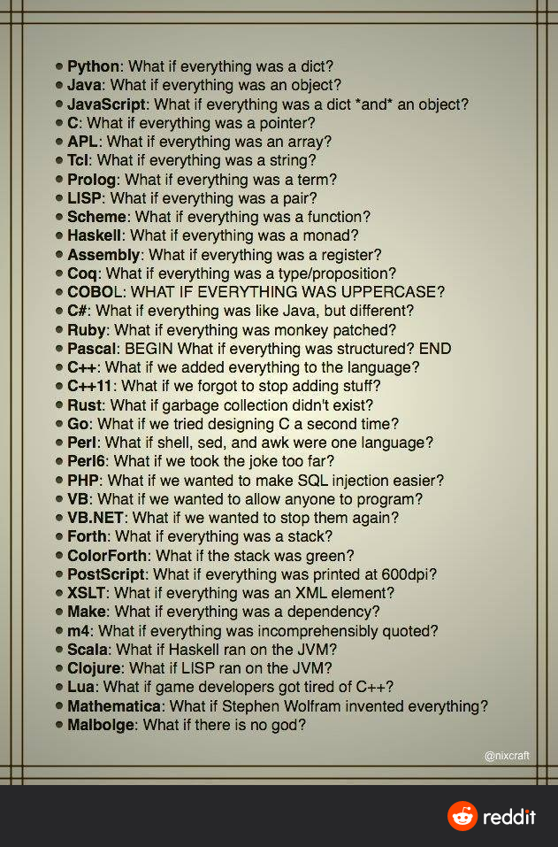

<!-- .slide: data-background="#111111" -->

# STL algorithms customization

___

## How to sort a container?

```cpp
std::vector<double> diffs = {1.1, -0.2, -1.3, 0.8, 0.1, -0.3}
```

### Use `std::sort`
<!-- .element: class="fragment fade-in" -->

```cpp
std::sort(diffs.begin(), diffs.end());
```
<!-- .element: class="fragment fade-in" -->

By default, sorting is done using `std::less` function, which calls `operator<` to compare elements.
<!-- .element: class="fragment fade-in" -->

### Result
<!-- .element: class="fragment fade-in" -->

`{-1.3, -0.3, -0.2, 0.1, 0.8, 1.1}`
<!-- .element: class="fragment fade-in" -->

___

## How to sort the container by absolute values?

Most of STL algorithms can be customized by passing an additional parameter - a special function object.
<!-- .element: class="fragment fade-in" -->

```cpp
bool absoluteCompare(double rhs, double lhs) {
    return std::abs(rhs) < std::abs(lhs);
}
std::sort(diffs.begin(), diffs.end(), absoluteCompare);
```
<!-- .element: class="fragment fade-in" -->

### Result
<!-- .element: class="fragment fade-in" -->

`{0.1, -0.2, -0.3, 0.8, 1.1, -1.3}`
<!-- .element: class="fragment fade-in" -->

#### How to get to know what signature should the function object have?
<!-- .element: class="fragment fade-in" -->
___

## Customization function

Each algorithm has a documented signature of needed function.

[Check `std::sort` on cppreference.com](https://en.cppreference.com/w/cpp/algorithm/sort)

___

## Common kinds of functions

* <!-- .element: class="fragment fade-in" --> (unary) predicate
  * returns `bool`, takes 1 arg
* <!-- .element: class="fragment fade-in" --> binary predicate
  * returns `bool`, takes 2 args
* <!-- .element: class="fragment fade-in" --> comparator
  * returns `bool` takes 2 args

___

## What is a *function object*?

It is any object for which the function call operator is defined - `operator()`.
<!-- .element: class="fragment fade-in" -->

* <!-- .element: class="fragment fade-in" --> pointer to function
* <!-- .element: class="fragment fade-in" --> functor
* <!-- .element: class="fragment fade-in" --> lambda expression
* <!-- .element: class="fragment fade-in" --> <code>std::function</code>
* <!-- .element: class="fragment fade-in" --> function?
  * no, it's not a *function object*, but it is implicitly convertible to *pointer to function*

___

## Sorting with a function

```cpp
bool absoluteCompare(double rhs, double lhs) {
    return std::abs(rhs) < std::abs(lhs);
}
std::sort(diffs.begin(), diffs.end(), absoluteCompare);
```
<!-- .element: class="fragment fade-in" -->

## Sorting with a functor
<!-- .element: class="fragment fade-in" -->

```cpp
struct AbsoluteCompare {
    bool operator()(double rhs, double lhs) {
        return std::abs(rhs) < std::abs(lhs);
    }
};
std::sort(diffs.begin(), diffs.end(), AbsoluteCompare{});
```
<!-- .element: class="fragment fade-in" -->

___

## Sorting with lambda

### Named lambda
<!-- .element: class="fragment fade-in" -->

```cpp
auto absoluteCompare = [](double rhs, double lhs) {
    return std::abs(rhs) < std::abs(lhs);
};
std::sort(diffs.begin(), diffs.end(), absoluteCompare);
```
<!-- .element: class="fragment fade-in" -->

### Unnamed lambda
<!-- .element: class="fragment fade-in" -->

```cpp
std::sort(diffs.begin(), diffs.end(), [](double rhs, double lhs) {
    return std::abs(rhs) < std::abs(lhs);
});
```
<!-- .element: class="fragment fade-in" -->

___

## Why so many ways?


<!-- .element: class="fragment fade-in" style="text-align: center" -->

___

## Lambda expressions

**Rationale**: functional programming, in-place functions, more universal function passing
<!-- .element: class="fragment fade-in" -->

Lambda expression is usually defined directly in-place of its usage. Usually it is used as a parameter of another function that expects pointer to function or functor - in general a callable object.
<!-- .element: class="fragment fade-in" -->

___

## Exercise

### `threeWays.cpp`

Use proper STL algorithm to check if all elements of the vector *numbers* are divisible by 3.

```cpp
std::vector numbers = {18, 21, 36, 90, 27, 14, 103};
```

Implement 3 versions:

* lambda
* functor
* function

___

### Solutions

#### Lambda
<!-- .element: class="fragment fade-in" -->

```cpp
bool result = std::all_of(numbers.begin(), numbers.end(), [](int number){
    return number % 3 == 0;
});
```
<!-- .element: class="fragment fade-in" -->

#### Function
<!-- .element: class="fragment fade-in" -->

```cpp
bool isDivisibleBy3(int number) {
    return number % 3 == 0;
}
bool result = std::all_of(numbers.begin(), numbers.end(), isDivisibleBy3);
```
<!-- .element: class="fragment fade-in" -->

___

### Solutions

#### Functor
<!-- .element: class="fragment fade-in" -->

```cpp
struct DivisibleBy {
    DivisibleBy(int n) : n_{n} {}
    bool operator()(int number) {
            return number % n_ == 0;
    }
private:
    int n_;
};
bool result = std::all_of(numbers.begin(), numbers.end(), DivisibleBy{3});
```
<!-- .element: class="fragment fade-in" -->

___

## Your conclusions

### What is a lambda expression?

* <!-- .element: class="fragment fade-in" --> It is a function object
* <!-- .element: class="fragment fade-in" --> Simple and short to write - <code>[](){}</code>
* <!-- .element: class="fragment fade-in" --> It is used to have a short form of writing a function object, which normally would take more characters to be typed
* <!-- .element: class="fragment fade-in" --> Provides better code readability
* <!-- .element: class="fragment fade-in" --> The type of lambda is called "closure"
* <!-- .element: class="fragment fade-in" --> Closure is known only to the compiler
* <!-- .element: class="fragment fade-in" --> To assign a lambda to a variable, it's type must be <code>auto</code>
